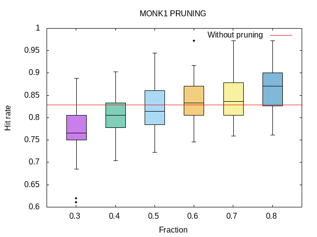
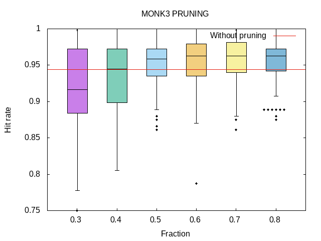

# Lab1 answers

## Assignment 0
Dataset 1 and 2 both require at most 2 questions to classify a sample while dataset 3 require at most 3. Dataset 3 also contains noise which makes it harder.

Turns out 2 is terrible, 1 is pretty bad and 3 is easy.

## Assignment 1
MONK1:  1.0

MONK2:  0.957117428264771

MONK3:  0.9998061328047111

## Assignment 2
Uniform means all outcomes have similar probability.
Entropy is always going to be high in a uniform distribution, close to max (1.0).
Entropy in a non-uniform distribution can be anything but will always be lower than max (if it is max the distribution is uniform).

Examples: 
A coin flip or dice throw dataset should be uniform with an entropy close to 1.

On the contrary a flip or throw with a weighted coin or die would be non-uniform and have significantly lower entropy where more heavily weighted would result in lower entropy.

Entropy is the measure of disorder and randomness in a system, lower entropy = more predictable and vice versa.

## Assignment 3
|Gain|	A1|		A2|		A3|		A4|		A5|		A6|
|-|-|-|-|-|-|-|
|MONK1|	0.0753|	0.0058|	0.0047|	0.0263|	0.287|	0.0008|
|MONK2|	0.0038|	0.0025|	0.0011|	0.0157|	0.0173|	0.0062|
|MONK3|	0.0071|	0.2937|	0.0008|	0.0029|	0.2559|	0.0071|

Based on the table above:
MONK1 should be split on A5.
MONK2 should be split on A5.
Monk3 should be split on A2.

## Assignment 4
When the information gain is maximized, the entropy of the subsets is minimized.
Minimizing the entropy of the subsets means the predictability of the data is maximized.

## Assignment 5
|DATA|TRAIN|TEST|
|-|-|-|
MONK1|1.0|0.8287037037037037
MONK2|1.0|0.6921296296296297
MONK3|1.0|0.9444444444444444

My predictions were terrible and completely wrong.

I'm guessing the information gain in all attributes in MONK2 is low because the model needs to know all attributes to decide if exactly 2 of them is 1.

Both MONK1 and MONK3 are reasonably good, I'm guessing MONK3's truth function is easy to predict because of A5 appearing twice.
## Assignment 6
Bias = How well the model fits the TRAINING data.
Variance = The difference in how well the model fits the training data and test data.

Pruning should lower both bias and variance to make the model fit the training data slightly less but fit the testing data better.

Reduce over fitting.
## Assignment 7

### MONK1

|FRAC|MEAN|VAR|
|-|-|-|
0.3|0.7775|0.002
0.4|0.7912|0.0016
0.5|0.8154|0.0019
0.6|0.8321|0.0019
0.7|0.8604|0.0024
0.8|0.8642|0.0027

UNPRUN	0.8287

### MONK3

|FRAC|MEAN|VAR|
|-|-|-|
0.3|0.9123|0.0038
0.4|0.9371|0.002
0.5|0.9513|0.0014
0.6|0.9564|0.001
0.7|0.9546|0.0012
0.8|0.9514|0.001

UNPRUN	0.9444

