# Support vector machine

## 1. Move clusters and change sizes to find when minimize don't work.
As long as the different class clusters don't overlap the classifier gets a nice result.

Increased size of clusters:
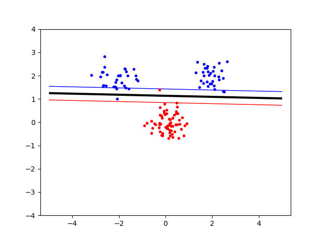

Decreased distance clusters:
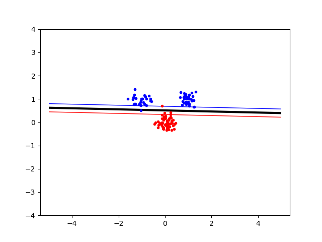

## 2. Non-linear kernel parameters from bias-variance trade-off perspective.
The *p* parameter in the poly_kernel function is the degree of the polynomial. If *p = 2* the resulting classifier plane will be in the form of a 2nd degree polynomial.
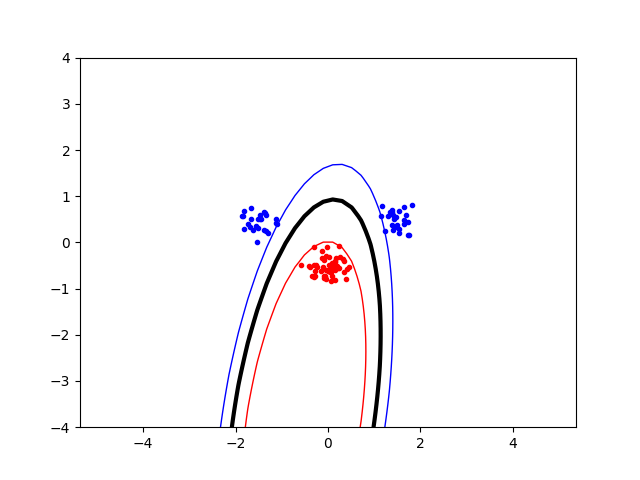

If *p = 1* the poly_kernel function is identical to the linear_kernel function.
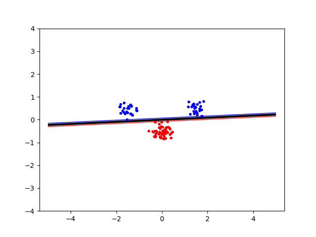

Lower *p* means higher **variance** and lower **bias** and vice versa. 

The *s* parameter in the radial_kernel function affects the radius of the resulting classifier circle.

If *s* is low, the circles will be small.
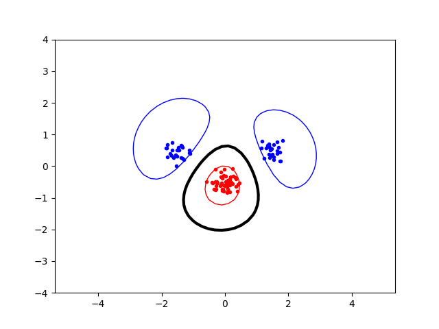

If *s* is high, the circle will be big.
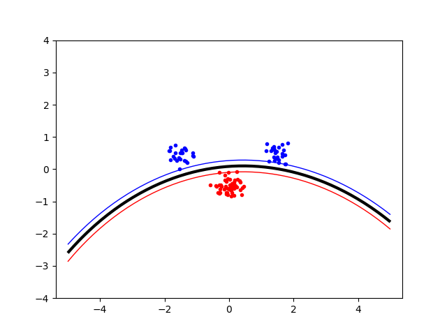

Lower *s* means higher **bias** and lower **variance** and vice versa.

## 3. What happens when *C* (slack parameter) is changed?
When *C* is changed, the punishment for points outside of the classifiers is changed. 

A very low value for *C* (close to zero, 0.1) will allow many of the training data points to be outside of its classifier or in the margin.
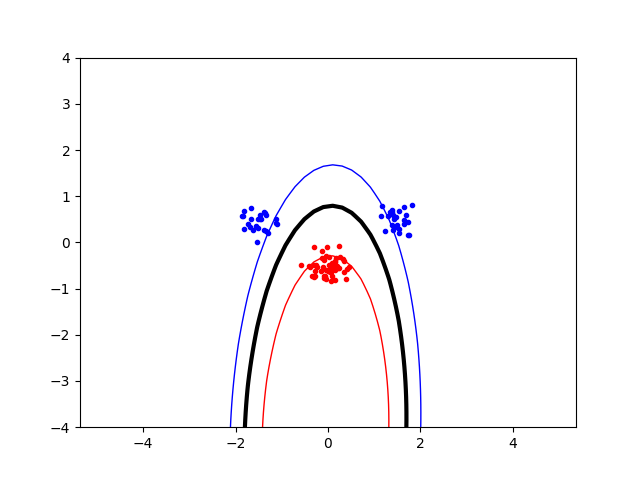

A higher value wouldn't allow any points outside of the classifier.

## 4. When to opt for more slack and when to opt for more complex kernel?
I should first try to find a kernel that results in a classifier with the correct general shape and then find the appropriate amount of slack.

### Example:
Consider the following dataset.

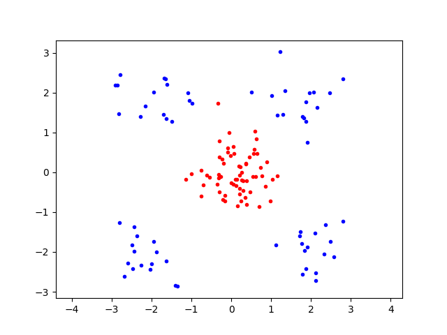

When using a linear kernel, the best we can accomplish with slack is something like this:

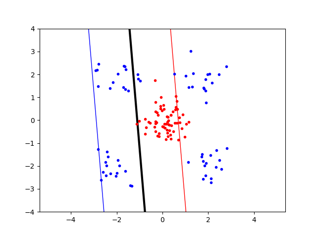

And when instead using a radial kernel without slack we get the generic circular shape we want.

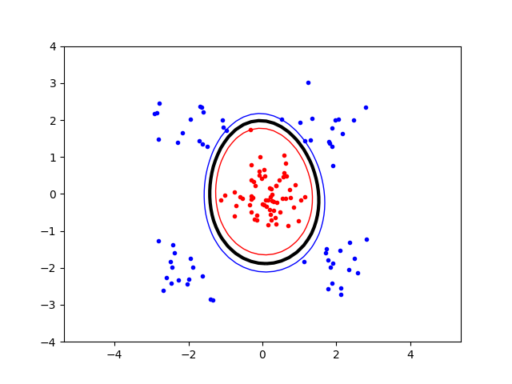

Now that we got the generic shape right we can allow some slack and we get a pretty good result.

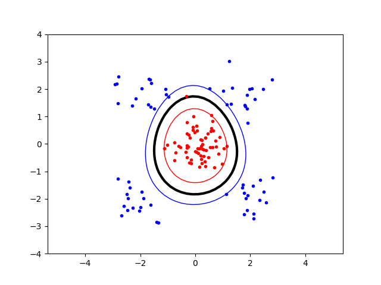