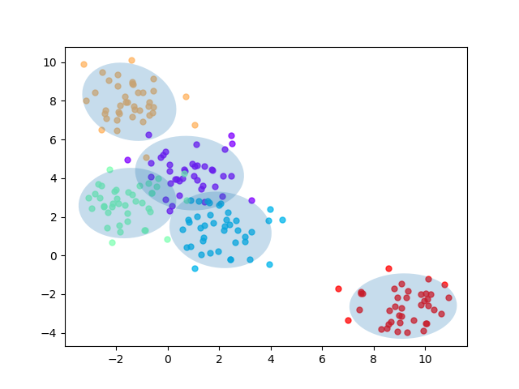
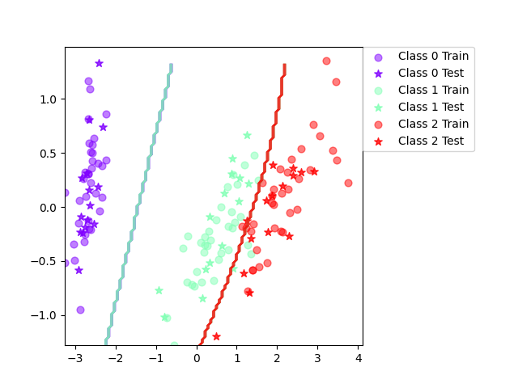
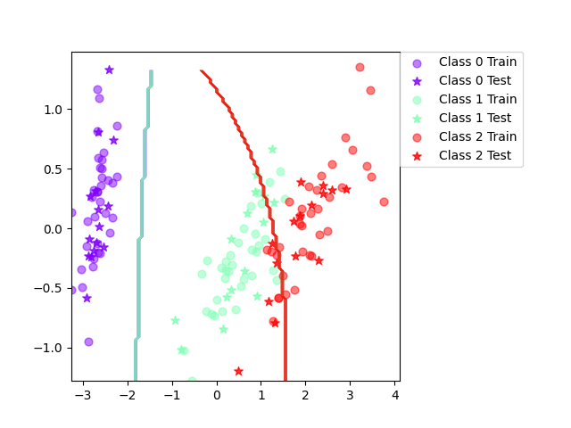

# Lab 3 answers

## Assignment 1

## Assignment 3

A feature independence assumption can reasonably be made when features are conditionally independent or at least reasonably independent. Naive Bayes can however perform very well even if the independence assumption is violated.

I think the decision boundary is pretty much as good as it gets. I don't think the classification could be better with another classifier or some data manipulation.

The above was written when naive Bayes wasn't naive, in the naive version there is clearly some improvements to be made. There is obviously some dependence between variables which should be accounted for.

## Assignment 4

## Assignment 5

## Assignment 6

