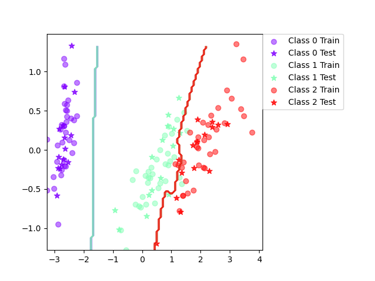
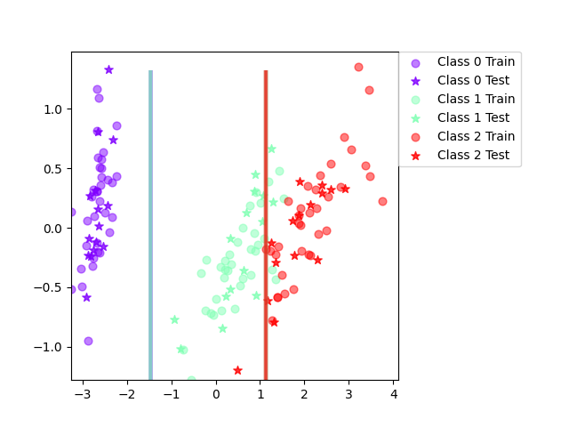
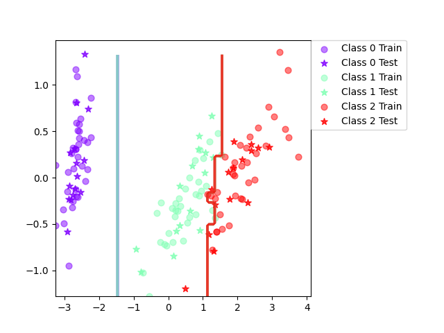

# Lab 3 answers

## Assignment 1

## Assignment 3

*Final mean classification accuracy 89 with standard deviation 4.16*

A feature independence assumption can reasonably be made when features are conditionally independent or at least reasonably independent. Naive Bayes can however perform very well even if the independence assumption is violated.

I think the decision boundary is pretty much as good as it gets. I don't think the classification could be better with another classifier or some data manipulation.

The above was written when naive Bayes wasn't naive, in the naive version there is clearly some improvements to be made. There is obviously some dependence between variables which should be accounted for.

## Assignment 5

*Final mean classification accuracy  94.8 with standard deviation 2.83*

The boosted classification has both better mean accuracy and lower standard deviation.
For each round of boosting the weights are updated to more heavily favor data points which were misclassified in the previous round. This makes the next round classifier more likely to get those points right.
Finally the booster will classify the points according to which class got the most votes in all rounds where votes from rounds with less error is favored.

The boosted classifier is more complex which makes sense since it is actually 10 classifiers working together.

Several weaker and more basic classifiers can together be stronger than a more advanced single classifier.

## Assignment 6

*Final mean classification accuracy  92.4 with standard deviation 3.71*

*Final mean classification accuracy  94.7 with standard deviation 3.65*

As previously, the boosted classifier has better mean accuracy and standard deviation but is more complex. 

## Assignment 7

If I know that my data is noisy I would not use either of the boosted classifiers because of their sensitivity to outliers. I think the decision tree classifier would perform best in such a case if you prune the tree. Naive Bayes would also work good.

I think a boosted naive Bayes would perform best in a dataset with some irrelevant inputs since the naive Bayes isn't prone to over-fitting like decision trees and the boosting will probably make the classifier find the truly important features.

Naive Bayes is the obvious choice of classifier for a dataset with mixed datatypes. Decision trees are better at handling discrete data and will lose valuable information if used on continuous data. I think the boosting will fit in here as well.

Naive Bayes will scale best because of the naive assumption of independence.